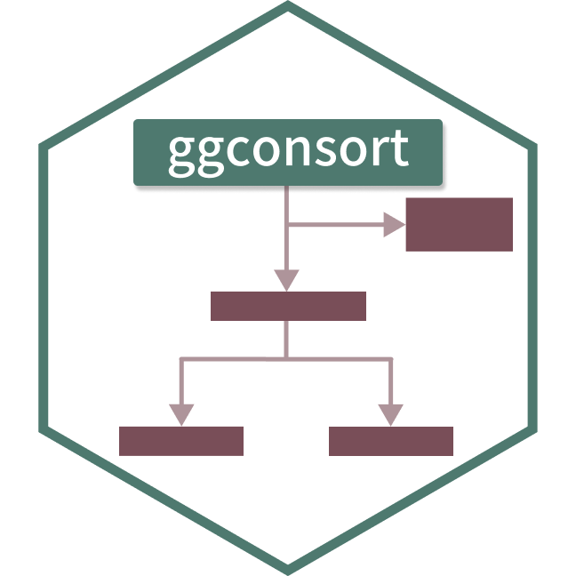

<!-- README.md is generated from README.Rmd. Please edit that file -->

```{r, include = FALSE}
knitr::opts_chunk$set(
  collapse = TRUE,
  comment = "#>",
  fig.path = "man/figures/README-",
  out.width = "100%",
  fig.retina = 3
)
```

# ggconsort 

<!-- badges: start -->
<!-- badges: end -->

## Overview

The goal of ggconsort is to provide convenience functions for creating [CONSORT diagrams](http://www.consort-statement.org/consort-statement/flow-diagram) with ggplot2. ggconsort segments CONSORT creation into two stages: (1) counting and annotation at the time of data wrangling, and (2) diagram layout and aesthetic design. With the introduction of a `ggconsort_cohort` class, stage (1) can be accomplished within dplyr chains. Specifically, the following functions are implemented inside a dplyr chain to define a `ggconsort_cohort`:

* `cohort_start()` initializes a `ggconsort_cohort` object which contains a labeled copy of the source data
* `cohort_define()` constructs cohorts that are variations of the source data or other cohorts
* `cohort_label()` adds labels to each named cohort within the `ggconsort_cohort` object

Stage 2 makes use of three ggconsort `consort_` verbs which equip the `ggconsort_cohort` object with `ggconsort` properties. The `ggconsort` object can be viewed with ggplot via `geom_consort() + theme_consort()`. `plot` and `print` methods are also available for the `ggconsort` object for visually iterative development.

* `consort_box_add()` adds a text box to the CONSORT diagram, at a `row`/`col` grid position (laid out automatically at draw time) or at explicit coordinates
* `consort_arrow_add()` adds an arrow to the CONSORT diagram
* `consort_line_add()` adds a line (without an arrow head) the CONSORT diagram
* `consort_stage_add()` adds a stage badge (e.g. "Allocation") to a row/column layout

## Installation

You can install the released version of ggconsort from [GitHub](https://github.com/tgerke/ggconsort) with:

``` r
# install.packages("devtools")
devtools::install_github("tgerke/ggconsort")
```

## Usage

To demonstrate usage, we use a simulated dataset within ggconsort called `trial_data`, which contains 1200 patients who were approached to participate in a randomized trial comparing Drug A to Drug B. 

```{r trial_data}
library(ggconsort)

head(trial_data)
```

Of the 1200 approached patients, only a subset were ultimately randomized: some declined to participate or were ineligible (due to prior chemotherapy or bone metastasis). We will use ggconsort verbs and geoms to count the patient flow and represent the process in a CONSORT diagram.

We first define the `ggconsort_cohort` object (`study_cohorts`) in the following dplyr chain.

```{r example-cohort, message=FALSE}
library(dplyr)

study_cohorts <- 
  trial_data |>
  cohort_start("Assessed for eligibility") |>
  # Define cohorts using named expressions --------------------
  # Notice that you can use previously defined cohorts in subsequent steps
  cohort_define(
    consented = .full |> filter(declined != 1),
    consented_chemonaive = consented |> filter(prior_chemo != 1),
    randomized = consented_chemonaive |> filter(bone_mets != 1),
    treatment_a = randomized |> filter(treatment == "Drug A"),
    treatment_b = randomized |> filter(treatment == "Drug B"),
    # anti_join is useful for counting exclusions -------------
    excluded = anti_join(.full, randomized, by = "id"),
    excluded_declined = anti_join(.full, consented, by = "id"),
    excluded_chemo = anti_join(consented, consented_chemonaive, by = "id"),
    excluded_mets = anti_join(consented_chemonaive, randomized, by = "id")
  ) |>
  # Provide text labels for cohorts ---------------------------
  cohort_label(
    consented = "Consented",
    consented_chemonaive = "Chemotherapy naive",
    randomized = "Randomized",
    treatment_a = "Allocated to arm A",
    treatment_b = "Allocated to arm B",
    excluded = "Excluded",
    excluded_declined = "Declined to participate",
    excluded_chemo = "Prior chemotherapy",
    excluded_mets = "Bone metastasis"
  )
```

We can have a look at the `study_cohorts` object with its print and summary methods:

```{r print-summary}
study_cohorts

summary(study_cohorts)
```

Next, we lay out the diagram. Boxes declare a `row` and `col` grid position instead of coordinates: `col = "main"` (the default) is the central spine, `"side"` puts a box to the right, and numbers give finer control (the arms below sit at columns -1 and 1). A box named after a cohort labels itself with that cohort's label and count, so most boxes need nothing but a name and a position, and `cohort_count_bullets()` builds the bulleted exclusion box in one call. Arrows just connect boxes by name — vertically within a column, horizontally within a row, and `end = c("treatment_a", "treatment_b")` draws the T-split into the study arms. Stage badges land in the left margin, as in the official CONSORT template. ggconsort measures every box when the plot is drawn and spaces the grid to fit the device, so there are no coordinates to fiddle with and nothing gets clipped.

```{r example-consort, fig.width = 9, fig.height = 4.25, fig.alt = "CONSORT diagram: 1,200 patients assessed for eligibility, 262 excluded (declined, prior chemotherapy, or bone metastasis), 938 randomized and allocated 469 each to arms A and B, with Enrollment and Allocation stage labels in the left margin"}
library(ggplot2)

study_consort <- study_cohorts |>
  consort_box_add(
    "full", row = 1, label = cohort_count_adorn(study_cohorts, .full)
  ) |>
  consort_box_add(
    "exclusions", row = 2, col = "side",
    label = cohort_count_bullets(
      study_cohorts, excluded,
      excluded_declined, excluded_chemo, excluded_mets
    )
  ) |>
  consort_box_add("randomized", row = 3) |>
  consort_box_add("treatment_a", row = 4, col = -1) |>
  consort_box_add("treatment_b", row = 4, col = 1) |>
  consort_arrow_add(start = "full", end = "randomized") |>
  consort_arrow_add(start = "full", end = "exclusions") |>
  consort_arrow_add(start = "randomized", end = c("treatment_a", "treatment_b")) |>
  consort_stage_add("Enrollment", row = c(1, 3)) |>
  consort_stage_add("Allocation", row = 4)

study_consort |>
  ggplot() +
  geom_consort(equal_columns = TRUE) +
  theme_consort()
```

The [complete CONSORT article](https://tgerke.github.io/ggconsort/articles/consort.html) continues this diagram through the Follow-up and Analysis stages, and the [PRISMA article](https://tgerke.github.io/ggconsort/articles/prisma.html) builds a PRISMA 2020 flow diagram with the same verbs. Styling lives in `geom_consort()` — fills, borders, corner radius, fonts, and spacing, with per-box overrides in `consort_box_add()`. Prefer to place things by hand? `consort_box_add()` and `consort_arrow_add()` also accept explicit coordinates — see `?consort_box_add`.

At this point, we are ready for analysis. The following retrieves the desired data frame of randomized subjects:

```{r pull-data}
study_cohorts |>
  cohort_pull(randomized)
```
