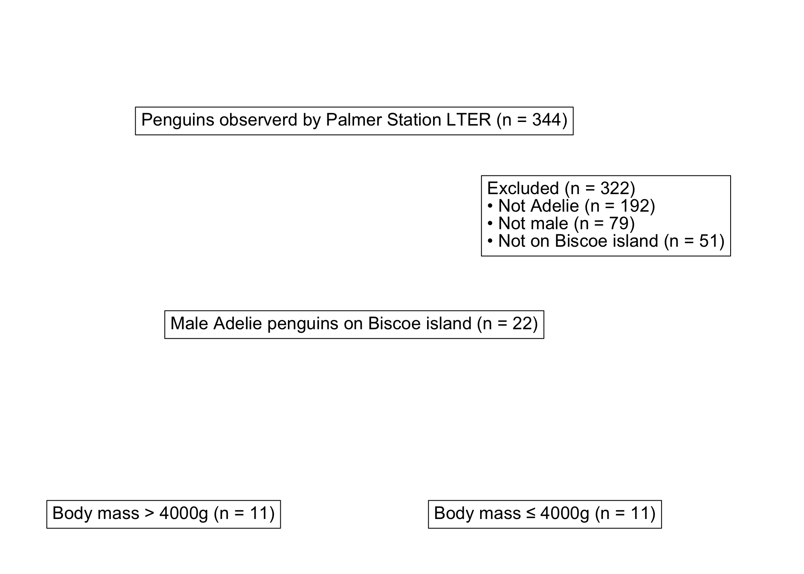

<!-- README.md is generated from README.Rmd. Please edit that file -->

# ggconsort 

<!-- badges: start -->
<!-- badges: end -->

## Overview

The goal of ggconsort is to provide convenience functions for creating
[CONSORT
diagrams](http://www.consort-statement.org/consort-statement/flow-diagram)
with ggplot2. ggconsort segments CONSORT creation into two stages: (1)
counting and annotation at the time of data wrangling, and (2) diagram
layout and aesthetic design. With the introduction of a
`ggconsort_cohort` class, stage (1) can be accomplished within dplyr
chains. Specifically, the following functions are implemented inside a
dplyr chain to define a `ggconsort_cohort`:

-   `cohort_start()` initializes a `ggconsort_cohort` object which
    contains a labeled copy of the source data
-   `cohort_define()` constructs cohorts that are variations of the
    source data or other cohorts
-   `cohort_label()` adds labels to each named cohort within the
    `ggconsort_cohort` object

Stage 2 makes use of three ggconsort `consort_` verbs which equip the
`ggconsort_cohort` object with `ggconsort` properties. The `ggconsort`
object can be viewed with ggplot via `geom_consort() + theme_consort()`.
`plot` and `print` methods are also available for the `ggconsort` object
for visually iterative development.

-   `consort_box_add()` adds a text box to the CONSORT diagram
-   `consort_arrow_add()` adds an arrow to the CONSORT diagram
-   `consort_line_add()` adds a line (without an arrow head) the CONSORT
    diagram

## Installation

You can install the released version of ggconsort from
[GitHub](https://github.com/tgerke/ggconsort) with:

``` r
# install.packages("devtools")
devtools::install_github("tgerke/ggconsort")
```

## Usage

To demonstrate usage, we use a simulated dataset within ggconsort called
`trial_data`, which contains 1200 patients who were approached to
participate in a randomized trial comparing Drug A to Drug B.

``` r
library(ggconsort)

head(trial_data)
#> # A tibble: 6 x 5
#>      id declined prior_chemo bone_mets treatment
#>   <int>    <int>       <int>     <int> <chr>    
#> 1 65464        0           0         0 Drug A   
#> 2 48228        0           0         0 Drug B   
#> 3 92586        0           0         0 Drug A   
#> 4 70176        0           0         0 Drug B   
#> 5 89052        0           0         0 Drug A   
#> 6 97333        0           0         0 Drug B
```

Of the 1200 approached patients, only a subset were ultimately
randomized: some declined to participate or were ineligible (due to
prior chemotherapy or bone metastasis). We will use ggconsort verbs and
geoms to count the patient flow and represent the process in a CONSORT
diagram.

We first define the `ggconsort_cohort` object (`study_cohorts`) in the
following dplyr chain.

``` r
library(dplyr)

study_cohorts <- 
  trial_data %>%
  cohort_start("Assessed for eligibility") %>%
  # Define cohorts using named expressions --------------------
  # Notice that you can use previously defined cohorts in subsequent steps
  cohort_define(
    consented = .full %>% filter(declined != 1),
    consented_chemonaive = consented %>% filter(prior_chemo != 1),
    randomized = consented_chemonaive %>% filter(bone_mets != 1),
    treatment_a = randomized %>% filter(treatment == "Drug A"),
    treatment_b = randomized %>% filter(treatment == "Drug B"),
    # anti_join is useful for counting exclusions -------------
    excluded = anti_join(.full, randomized, by = "id"),
    excluded_declined = anti_join(.full, consented, by = "id"),
    excluded_chemo = anti_join(consented, consented_chemonaive, by = "id"),
    excluded_mets = anti_join(consented_chemonaive, randomized, by = "id")
  ) %>%
  # Provide text labels for cohorts ---------------------------
  cohort_label(
    consented = "Consented",
    consented_chemonaive = "Chemotherapy naive",
    randomized = "Randomized",
    treatment_a = "Allocated to arm A",
    treatment_b = "Allocated to arm B",
    excluded = "Excluded",
    excluded_declined = "Declined to participate",
    excluded_chemo = "Prior chemotherapy",
    excluded_mets = "Bone metastasis"
  )
```

We can have a look at the `study_cohorts` object with its print and
summary methods:

``` r
study_cohorts
#> A ggconsort cohort of 1200 observations with 9 cohorts:
#>   - consented (1141)
#>   - consented_chemonaive (1028)
#>   - randomized (938)
#>   - treatment_a (469)
#>   - treatment_b (469)
#>   - excluded (262)
#>   - excluded_declined (59)
#>   - excluded_chemo (113)
#>   ...and 1 more.

summary(study_cohorts)
#> # A tibble: 10 x 3
#>    cohort               count label                   
#>    <chr>                <int> <chr>                   
#>  1 .full                 1200 Assessed for eligibility
#>  2 consented             1141 Consented               
#>  3 consented_chemonaive  1028 Chemotherapy naive      
#>  4 randomized             938 Randomized              
#>  5 treatment_a            469 Allocated to arm A      
#>  6 treatment_b            469 Allocated to arm B      
#>  7 excluded               262 Excluded                
#>  8 excluded_declined       59 Declined to participate 
#>  9 excluded_chemo         113 Prior chemotherapy      
#> 10 excluded_mets           90 Bone metastasis
```

Next, we add CONSORT “boxes” and “arrows” with appropriate ggconsort
verbs, and plot with the CONSORT diagram `ggplot`. Note the use of
`cohort_count_adorn()`, which is a convenience function that glues
cohort counts to their labels.

``` r
library(ggplot2)

study_consort <- study_cohorts %>%
  consort_box_add(
    "full", 0, 50, cohort_count_adorn(study_cohorts, .full)
  ) %>%
  consort_box_add(
    "exclusions", 20, 40, glue::glue(
      '{cohort_count_adorn(study_cohorts, excluded)}<br>
      • {cohort_count_adorn(study_cohorts, excluded_declined)}<br>
      • {cohort_count_adorn(study_cohorts, excluded_chemo)}<br>
      • {cohort_count_adorn(study_cohorts, excluded_mets)}
      ')
  ) %>%
  consort_box_add(
    "randomized", 0, 30, cohort_count_adorn(study_cohorts, randomized)
  ) %>%
  consort_box_add(
    "arm_a", -30, 10, cohort_count_adorn(study_cohorts, treatment_a)
  ) %>%
  consort_box_add(
    "arm_b", 30, 10, cohort_count_adorn(study_cohorts, treatment_b)
  ) %>%
  consort_arrow_add(
    end = "exclusions", end_side = "left", start_x = 0, start_y = 40
  ) %>%
  consort_arrow_add(
    "full", "bottom", "randomized", "top"
  ) %>% 
  consort_arrow_add(
    start_x = 0, start_y = 30, end_x = 0, end_y = 20,
  ) %>%
  consort_line_add(
    start_x = -30, start_y = 20, end_x = 30, end_y = 20,
  ) %>% 
  consort_arrow_add(
    end = "arm_a", end_side = "top", start_x = -30, start_y = 20
  ) %>%
  consort_arrow_add(
    end = "arm_b", end_side = "top", start_x = 30, start_y = 20
  )

study_consort %>%
  ggplot() + 
  geom_consort() +
  theme_consort(margin_h = 8, margin_v = 1) +
  # you can include other ggplot geoms, as needed -------------
  ggtext::geom_richtext(
    aes(x = 0, y = 10, label = "Allocation"),
    fill = "#9bc0fc"
  )
```



At this point, we are ready for analysis. The following retrieves the
desired data frame of randomized subjects:

``` r
study_cohorts %>%
  cohort_pull(randomized)
#> # A tibble: 938 x 5
#>       id declined prior_chemo bone_mets treatment
#>    <int>    <int>       <int>     <int> <chr>    
#>  1 65464        0           0         0 Drug A   
#>  2 48228        0           0         0 Drug B   
#>  3 92586        0           0         0 Drug A   
#>  4 70176        0           0         0 Drug B   
#>  5 89052        0           0         0 Drug A   
#>  6 97333        0           0         0 Drug B   
#>  7 80724        0           0         0 Drug A   
#>  8 65186        0           0         0 Drug B   
#>  9 48837        0           0         0 Drug A   
#> 10 99005        0           0         0 Drug B   
#> # … with 928 more rows
```
